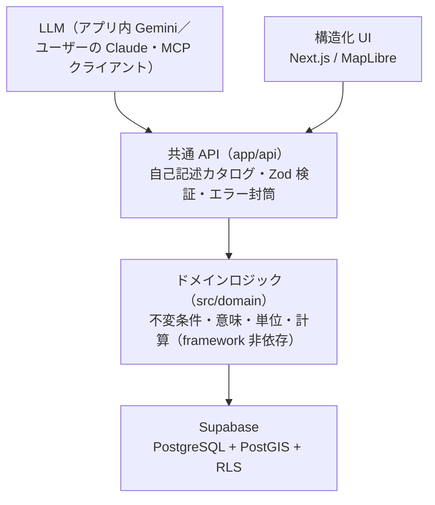

# AI Database Map

オープンデータ（乗降客数・人口・地価・バス・事業所・従業者）を **駅 × 半径** で集約し、**地図 ＋ AI** で誰でも使えるようにする、AIネイティブな Web アプリ。

鉄道会社の輸送計画、店舗出店の商圏分析、住宅購入の検討などを想定しています。

---

## コンセプト：「API こそがプロダクト」

従来の SaaS は UI が特権的で API は副産物でした。本プロジェクトはこれを反転させ、**人間の UI と AI（LLM）が同じ共通 API を対等に叩く**構造にします。メトリクスの定義・ラベル・単位・半径変換・ランキング・クラスタリングといった「意味」は、すべてサーバの共通 API（＝ドメイン層）が持ちます。



- **自己記述的**：利用可能な指標・半径・年・単位・ラベルを機械可読で返す**メトリクス・カタログ**を単一の真実（`src/shared/catalog`）として持ち、UI・API・（将来の）AI ツールがすべてこれを参照します。
- **通信契約**：フロントと AI が従う標準インターフェース「**GUI Chat Protocol (Map Edition)**」の型に API 応答を合致させ、クリックと会話が同じ描画パスを通るように設計しています。

---

## 主な機能（Step1）

- 全国 **9,273 駅**の地図（国土地理院ベクトルタイル・クラスタリング）
- 駅名検索 → 駅クリックで**詳細パネル**（乗降客・人口〔実績＋将来推計2系統〕・地価・バス・事業所・従業者のチャート＋**信頼性フラグ**）
- **半径切替（6段：500m〜20km）** — 再フェッチなしで即時再計算
- **都道府県ランキング**（複数県・全件ページング・低分母除外）
- **増減率の散布図**（決定的 k-means クラスタリング）
- **データ出典・ライセンス表示**（カタログから自動生成）
- モバイル対応・エラー/オフライン/404 ハンドリング

---

## あなたの Claude で使う（Step2・リモート MCP）

共通 API を**リモート MCP サーバ（12 ツール・読み取り専用・認証不要）**として公開しています。
ユーザー自身の Claude サブスクリプション（**API キー不要・追加費用なし**）で、住宅購入・鉄道の輸送計画・出店の商圏分析などの分析グレードの支援ができます。
**導入ページ：<https://ai-database-map.vercel.app/ai>**

### 導入

| クライアント                        | 手順                                                                                                                                                                                                                                                                               |
| ----------------------------------- | ---------------------------------------------------------------------------------------------------------------------------------------------------------------------------------------------------------------------------------------------------------------------------------- |
| **Claude Code**（推奨・スキル込み） | `/plugin marketplace add kusui26/AI-Database-Map` → `/plugin install ai-database-map@ai-database-map`                                                                                                                                                                              |
| **Claude.ai**（Free でも 1 個まで） | [導入リンク](https://claude.ai/customize/connectors?modal=add-custom-connector&connectorName=AI%20Database%20Map&connectorUrl=https%3A%2F%2Fai-database-map.vercel.app%2Fapi%2Fmcp)、または 設定 › コネクタに URL を追加：`https://ai-database-map.vercel.app/api/mcp`（認証なし） |
| **Claude Cowork**                   | Connectors に同じ URL・Plugins に `kusui26/AI-Database-Map`（git URL）                                                                                                                                                                                                             |
| **Codex CLI**                       | `codex plugin marketplace add kusui26/AI-Database-Map` → `/plugins` から Install（`.codex-plugin`／`.agents` 同梱）                                                                                                                                                                |
| ChatGPT / Cursor / VS Code など     | 同じ MCP URL（streamable HTTP）                                                                                                                                                                                                                                                    |

### 入っているもの

- **ツール 12 本**：駅検索・一覧（市区町村/会社/路線/範囲）・**`build_dataset`**（駅×指標 CSV を短命 URL で 1 回生成・災害列の結合可）・**`get_hazard_summary`**（全駅事前計算の災害サマリ ≤500 駅一括）・駅詳細・ランキング・散布・地点ハザード・警報・避難場所・脱出方向・自己記述カタログ
- **スキル**（Claude Code / Cowork / Codex）：分析の型（`station-analysis`）＋用途別レシピ——住宅 `/ai-database-map:recommend`・輸送計画 `:demand`・出店 `:market`——＋ `analyze-csv`・`hazard-reading`
- **golden 受け入れテスト**：`plugins/ai-database-map/evals/`（`claude plugin eval` 形式・3 ユースケースの実走で 5/5・3/3・3/3 合格済み）

### プラン・利用枠の注意

- 推論は**ユーザーの枠**を消費します（Pro/Max は 5 時間枠＋週次枠を Claude／Claude Code／Cowork で共有。寄与率は `/usage`）
- 枠にやさしい設計：応答は要約中心・多数駅の行データは **CSV の URL** で渡してローカルで分析（150 駅×20 指標でもツール呼び出しは数回）
- サーバ側レート制限あり（IP 60 回/分・生成系は厳しめ）。災害の応答は limitations（想定であり現況ではない等）を必ず同梱します

---

## 技術スタック

| 領域           | 採用                                                                 |
| -------------- | -------------------------------------------------------------------- |
| フレームワーク | Next.js 16（App Router・Turbopack）/ React 19 / TypeScript 6         |
| スタイル       | Tailwind CSS v4                                                      |
| 地図           | MapLibre GL JS（国土地理院 最適化ベクトルタイル）                    |
| チャート       | Chart.js 4 + react-chartjs-2                                         |
| 状態           | Zustand（地図・選択）+ nuqs（URL 同期）                              |
| データ取得     | SWR                                                                  |
| 契約・検証     | Zod 4（`z.infer` で型導出）                                          |
| DB             | Supabase（PostgreSQL + PostGIS + PostgREST RPC・RLS）                |
| テスト/品質    | Vitest 4 / ESLint 10（`any`・`as` 禁止＋レイヤ境界ルール）/ Prettier |
| データ生成     | Python（pandas・psycopg）                                            |
| デプロイ       | Vercel（+ Cron による Supabase keep-alive）                          |

---

## セットアップ

### 前提

- Node.js 22.x / pnpm 11
- Supabase プロジェクト（PostgreSQL + PostGIS）
- （データ生成する場合のみ）Python 3・e-Stat API の appId

### 手順

```bash
# 1. 依存インストール
pnpm install

# 2. 環境変数（.env.example をコピーして実値を記入。.env は gitignore 済み）
cp .env.example .env
#   アプリ実行に最低限必要：SUPABASE_URL / SUPABASE_ANON_KEY
#   本番の OG/canonical 用：NEXT_PUBLIC_SITE_URL

# 3. 開発サーバ
pnpm dev            # http://localhost:3000

# 4. 品質ゲート
pnpm typecheck
pnpm lint
pnpm test

# 5. 本番ビルド / 起動
pnpm build
pnpm start
```

### データパイプライン（任意・データを作り直す場合）

`pipeline/` の Python スクリプトで、公開オープンデータ → ワイド CSV（`data/derived/station_dataset.csv`）→ カタログ（`catalog.json`）→ Supabase 投入（`stations` / `metric_columns` / `station_values`）を行います。`data/` と `slide/` は容量・機密のため gitignore です。

---

## データ出典・ライセンス

指標カタログ（`src/shared/catalog/catalog.json`）の各エントリが `source` / `license` を持ち、アプリ内の「このアプリ・データ出典」ダイアログに**自動生成**で表示されます。

| 出典                                              | 対象           | ライセンス                                   |
| ------------------------------------------------- | -------------- | -------------------------------------------- |
| 国土数値情報「駅別乗降客数」(S12)                 | 乗降客数       | CC BY 4.0 相当（利用約款・出典明記で商用可） |
| 総務省 国勢調査 地域メッシュ統計（e-Stat）        | 人口           | CC BY 4.0（政府統計）                        |
| 国土数値情報 将来推計人口メッシュ                 | 将来推計人口   | CC BY 4.0 相当                               |
| 国土数値情報「地価公示」(L01)                     | 地価           | CC BY 4.0 相当                               |
| 国土数値情報 バス停留所 P11 ＋ 高速バス P36       | バス           | CC BY 4.0                                    |
| 国土数値情報 バス停留所 P11（2010・増減率の分母） | バス           | ⚠ 非商用（商用は要確認）                     |
| 経済センサス‑活動調査 地域メッシュ統計（e-Stat）  | 事業所・従業者 | CC BY 4.0 相当                               |

地図：[国土地理院 最適化ベクトルタイル](https://www.gsi.go.jp/)。数値は各公的統計の二次加工であり、原典の定義・年次・集計単位に依存します。

---

## プロジェクト構成

```
src/
  app/            Next.js ルート（page / layout / api / error / not-found …）
  components/     UI（地図・ヘッダ・検索・FAB・ダイアログ・パネル）
  domain/         ドメインロジック（純関数・framework 非依存・DB 非依存）
  db/             Supabase クライアント＋RPC ラッパ（Zod 検証）
  shared/         カタログ・契約（api / protocol）・定数・整形
supabase/migrations/   バージョン管理された SQL（RPC・スキーマ・RLS）
pipeline/         データ生成・投入（Python）
docs/             設計ドキュメント（architecture.md / plan_fable.md ほか）
tests/            ドメイン純関数の単体テスト（Vitest）
```

依存方向は **UI → 共通 API → domain → DB** の一方向。ESLint のレイヤ境界ルールで `domain` から UI/DB への import を禁止しています。

---

## デプロイ

Vercel に接続し、`main` へのマージで本番デプロイされます。`vercel.json` の Cron（毎日 03:00 UTC → `/api/health`）が DB に 1 クエリ投げ、Supabase 無料枠の自動停止を防ぎます。本番の環境変数（`SUPABASE_URL` / `SUPABASE_ANON_KEY` / `NEXT_PUBLIC_SITE_URL`）は Vercel ダッシュボードで設定します。

---

## ドキュメント

- [`docs/architecture.md`](docs/architecture.md) — アーキテクチャ・スキーマ・共通 API・デプロイ
- [`docs/plan_fable.md`](docs/plan_fable.md) — 実装計画と進捗
- [`.claude/CLAUDE.md`](.claude/CLAUDE.md) — 開発指針・コーディング規約

---

## ステータス

**Step1（データ刷新＋公開）・Step2（AI ネイティブ化）完了。** アプリ内 Gemini チャットに加え、リモート MCP（12 ツール）＋ Claude Code / Codex プラグイン＋分析スキル（3 ユースケースの golden 受け入れテストつき）を公開済み。経緯と設計判断は [`docs/260828_research_claude_auth.md`](docs/260828_research_claude_auth.md) を参照。
